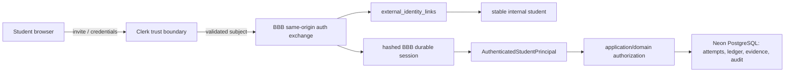
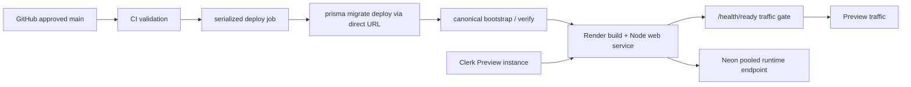

# D-001 Preview Environment Architecture and Production Authentication Decision

Status: proposed for D-002 implementation. D-001 creates no infrastructure and changes no runtime behavior.

## Decisions

| Concern | Decision |
|---|---|
| Authentication | Clerk Pro, email/password, email verification, invite-only access mode; no social login or organizations |
| Session integration | Model A: Clerk proves identity once, BBB creates and thereafter authorizes its own durable opaque session |
| Identity | `(provider, provider subject)` links to a stable internal `runtime_students.id`; provider IDs never own attempts |
| Preview provisioning | BBB issues a Clerk invitation and pre-provisions or atomically links one active internal student |
| Host | One paid Render Node web service, deployed from approved `main`, no separate browser-visible API |
| Database | One Neon project, one long-lived Preview branch/database in the closest common region to Render |
| Connections | Pooled TLS URL for Prisma runtime; separately scoped direct TLS URL for serialized migration/bootstrap jobs |
| Delivery | CI approval -> serialized pre-deploy migration/bootstrap -> readiness -> Render traffic |
| PR previews | Disabled until an isolated ephemeral database/auth design exists; never point at Preview data |

These choices preserve D-000R rather than replacing it. Clerk and Render adapters are thin boundary work for D-002. Accounting, authorization, student-safe serialization, sessions, and canonical truth remain provider-neutral domain/application concerns.

## Actual merged runtime

Baseline `08a6a25aa31318006791bae20f203f39723c8e05` is a raw Node 22 `node:http` service. `pnpm build` compiles TypeScript; `pnpm start:web` starts `dist/apps/web/server.js`. The web process serves HTML, assets, `/api/student`, mutations, authentication endpoints, `/health/live`, and `/health/ready` from one origin. `apps/api/server.ts` is only a health stub and is not a second application service.

`DURABLE_RUNTIME_ENABLED=true` selects `PrismaStudentAttemptRepository` and `PrismaStudentSessionAuthenticator`. Attempts, relational accounting, bounded workflow aggregates, idempotency, snapshots, identity links, and hashed sessions are PostgreSQL-backed. Production exits when durable mode is false; local authentication is disabled whenever `NODE_ENV=production`; database/readiness failure yields bounded 503 behavior and never selects memory storage. `APP_ORIGIN` is the exact Origin accepted for cookie-authenticated mutations. Current deploy order is frozen install, Prisma generation/build, committed migrations, canonical bootstrap, then readiness and traffic.

## Environment model

| Environment | Purpose and data | Identity | Database/runtime |
|---|---|---|---|
| Local | Engineering, automated tests, destructive validation; fictional case and identities only | Explicit `LOCAL_AUTH_ENABLED=true` where intended | Local/disposable PostgreSQL; in-memory adapters only in explicit test/development modes |
| Preview | BBB acceptance and a controlled real-student pilot; minimal identity and fictional Suncoast activity | Clerk invite-only; local auth forbidden | Persistent isolated Neon Preview; paid Render Node service; encrypted platform secrets |
| Production | Future public operating boundary only | Separately reviewed production Clerk instance/configuration | Separately reviewed database, service, domain, retention, support, and compliance posture |

Preview is not Production: it has a preview hostname, constrained invite list, pilot retention policy, modest recovery window, and no promise of general availability.

## Authentication decision

The detailed provider comparison is in [D001-COMPARISONS.md](./D001-COMPARISONS.md). Clerk is selected because invite-only is a first-class application access mode, email/password activation and provider-managed recovery are available, its backend SDK can validate a session for a raw Node adapter, and its small-pilot operational surface is lower than Auth0's custom invitation workflow. Supabase Auth is viable but would add a second database-platform identity model beside Neon and makes the intended provider/database separation less legible.

### Model A flow

1. The browser follows Clerk's same-site sign-in/activation flow. D-002 must use Clerk's documented request validation, fixed issuer/audience/authorized-party expectations, and CSRF protections.
2. BBB's callback/exchange endpoint validates the Clerk session server-side. No email, subject, or student ID supplied by the browser is trusted.
3. In one transaction BBB resolves an active `external_identity_links(provider='clerk', subject)` record and its active `runtime_students` row. First activation may consume an exact pending invitation keyed by normalized email and create the link once.
4. BBB revokes/replaces the prior BBB session as policy requires and creates the existing random opaque session. Only its SHA-256 hash is stored; the browser receives `HttpOnly; Secure; SameSite=Strict; Path=/`.
5. Subsequent application requests use the BBB session and existing `AuthenticatedStudentPrincipal`. Clerk is not imported by domain or student application code.
6. Logout revokes the BBB session, clears its cookie, and ends the Clerk browser session. Deactivation revokes every BBB session even if Clerk still considers its session valid.

The exchange is a same-origin, one-time POST after Clerk authentication. BBB requires the exact Preview `Origin`, validates Clerk's signed proof server-side with the configured issuer, audience and `authorizedParties`, rejects expired/pending/non-authenticated sessions, and obtains the unique Clerk user ID only from verified authentication state. It then fetches/validates the backend user when needed to confirm `banned=false`, `locked=false`, and the invited primary email is verified. The exchange body contains no identity selector. Replaying valid Clerk proof cannot create a second identity: provider-link and invitation-consumption uniqueness plus BBB session replacement make the transaction idempotent for that subject; an expired proof fails. Mapping, invitation consumption, activation, old-session revocation, and new BBB-session creation commit atomically. Errors for uninvited, unmapped, inactive, duplicate, or invalid identities use one bounded unavailable response.

The resulting BBB session has an eight-hour Preview TTL. Clerk expiry after a successful exchange does not silently terminate the already-issued BBB session; BBB status, expiry and revocation remain authoritative for application access. A password reset likewise does not erase attempts or change ownership. Clerk account deletion, ban, or lock triggers immediate-as-delivered internal deactivation through the required lifecycle webhook below; the exchange also rechecks provider state, bounding missed-webhook risk. BBB deactivation or session revocation takes effect immediately without waiting for Clerk. Operator-initiated revocation disables the internal student, revokes all BBB sessions, and bans/revokes Clerk access as the provider permits.

### Required lifecycle webhook

D-002 must configure a Clerk webhook; this is not left optional. Accept only `user.updated` and `user.deleted`. A verified deletion, ban, or lock deactivates the linked internal student and revokes every BBB session while preserving attempts/history. Verified email changes update contact email only after uniqueness checks and never relink ownership. Unknown subjects are recorded as bounded operator events and create no student.

The webhook is server-to-server POST at a dedicated BBB path, never a browser authority. Verify the Standard Webhooks/Svix signature over the unmodified body using `CLERK_WEBHOOK_SIGNING_SECRET`; reject stale timestamps under the library's supported tolerance. Persist the provider event ID under a unique constraint before applying state changes, so retries/replays are idempotent. Process supported events transactionally and return non-2xx on transient failure so Clerk/Svix retries; permanent unsupported events return bounded 2xx without mutation. Logs contain event ID/type and internal opaque IDs, never the signed body or user payload.

Model B is rejected because validating provider state on every domain request couples availability, token semantics, and revocation to Clerk and bypasses the already-proven durable BBB session boundary.

## Internal identity and provisioning

BBB stores a UUID internal student ID, normalized current email, optional display name, status (`INVITED`, `ACTIVE`, `DEACTIVATED`), timestamps, and provider link (`provider`, immutable provider subject, link timestamps/status). Provider subject is unique per provider and each active link points to one student. Email assists provisioning and support but is neither an ownership key nor proof of identity. Clerk stores password credentials, verification/recovery state, invitation state, and provider sessions/tokens; BBB stores no password hash or provider token.

Provisioning is invite-only:

1. BBB operator creates an `INVITED` internal student/pending invitation with normalized unique email, then sends a Clerk invitation.
2. Clerk sends the activation link; the student verifies email and establishes credentials.
3. On first validated exchange, BBB requires an unconsumed matching invitation, verifies that the Clerk email is verified, creates exactly one provider link, activates the student, and creates a BBB session.
4. Existing provider subjects resolve by subject, not mutable email. A duplicate subject, duplicate active email, mismatched invitation, uninvited authenticated user, or missing mapping fails with one bounded unavailable response and an operator-safe event.
5. `INVITED` users have no application session. `DEACTIVATED` users cannot exchange or authenticate; all BBB sessions are revoked and attempts/history remain intact.

Clerk Preview access mode must be `restricted` (invite-only). Public signup, waitlist, social providers, organizations, and user impersonation are disabled. Password reset and account recovery are Clerk-managed. BBB support may resend/revoke invitations or deactivate access, but never receives passwords.

Clerk Pro is the selected minimum Preview tier, even though core invite-only/password capabilities may be available on Hobby. Pro provides an explicit paid operating posture, customizable session policy and longer application-log retention for a real-student pilot. D-002 must reverify those entitlements before purchase and stop if `restricted` access, email/password verification/recovery, backend validation, invitations, session revocation, or required webhook delivery is unavailable on the chosen configuration.

## Neon topology

Use Neon Launch: one project dedicated to BBB Preview, with one long-lived `preview` branch and one application database. Select an eastern-US Render region appropriate to the expected BBB/tester population, then choose the closest available Neon region; record both and measure connection latency during D-002. If tester geography changes, choose lowest measured application-to-database latency rather than independently choosing browser-nearest regions. Do not share this project with local tests or future Production.

Runtime uses a TLS pooled endpoint (`-pooler`) through `DATABASE_URL`, with a conservative Prisma connection limit established by load testing and Render instance count. D-002 should start with one Render instance; horizontal scaling is allowed because D-000R provides CAS/idempotency and durable sessions. A separately stored `DIRECT_DATABASE_URL` uses a direct endpoint and a narrowly privileged deploy role for migrations/bootstrap. Although current Prisma can operate through Neon pooling, the separate direct deployment credential creates clearer least privilege and predictable administrative locking. Application credentials cannot alter schema or disable triggers.

The runtime role receives connect/schema usage, sequence usage, and only the table DML needed by legitimate Lab operations. It is not a database owner, superuser, `BYPASSRLS` role, migration owner, or trigger owner; it cannot create/alter/drop schema objects, disable triggers, change immutable canonical/template/bootstrap rows, or grant privileges. The deploy role owns/applies committed migrations and can install triggers/constraints. Bootstrap runs only in the serialized deploy job with a separately scoped bootstrap/deploy credential capable of initial canonical inserts; that URL is absent from Render runtime. D-002 must prove runtime DDL and trigger-disable attempts fail.

Destructive commands require a database guard: tests accept only an explicit disposable-test marker and reject database/project names matching `bbb_practice_preview`; migration/bootstrap require the inverse Preview marker. Protected Preview credentials exist only in the approved deployment environment and are never provided to pull-request jobs.

No persistent per-PR Neon branch is enabled initially. Destructive CI remains disposable PostgreSQL. A future controlled workflow may create expiring child branches with scrubbed/fictional data and unique credentials, but arbitrary PR code must never receive Preview credentials.

Preview recovery uses Neon's restore/history capability and historical branches within the subscribed plan's configured window. Choose a paid plan and a seven-day restore window before admitting real pilot users. For accidental deletion or canonical modification: stop traffic, identify the safe timestamp, create/inspect a recovery branch, restore according to Neon's supported workflow, rerun migration status/bootstrap verification, and reopen only after readiness and smoke checks. Export an encrypted logical backup before high-risk migrations. Recovery is operationally tested before pilot; D-001 does not promise enterprise DR.

## Hosting and same-origin topology

Render is selected as one paid Starter (`0.5c-512mb`, subject to D-002 capacity verification) web service because it runs the existing long-lived Node process directly, accepts explicit build/start commands, supports GitHub deployments, encrypted variables, HTTP readiness checks, logs, zero-downtime deploys, custom domains, and artifact rollback. Paid instances do not idle-sleep. Configure the service to bind `0.0.0.0:$PORT`; D-002 may add the small `PORT` alias/graceful-shutdown adapter needed because the current server reads `WEB_PORT`.

Vercel is rejected for Preview: its natural unit is request-scoped Functions. Converting the raw listener, sequencing one-off migration/bootstrap work, and expressing the existing liveness/readiness traffic contract would add an avoidable platform adapter and operational ambiguity. Fly.io is technically strong but introduces image/Machine/network configuration beyond this pilot's needs. Railway is viable, but Render's explicit HTTP readiness traffic gate and rollback documentation best match D-000R.

The authoritative Preview URL is `https://preview.clientpracticelabs.com`. Browser, assets, authentication exchange, application API, and actions remain on that origin. Clerk redirects only to allowlisted Preview URLs. There is no CORS-enabled business API; cookies never need cross-origin credential mode. Exact `APP_ORIGIN`, `SameSite=Strict`, Secure cookies, and Origin validation remain mandatory. `https://app.clientpracticelabs.com` is reserved for a separately reviewed future Production deployment, and the root domain remains available for a future public/product site.

BBB's cookie is host-only (no `Domain` attribute), `Secure`, `HttpOnly`, `SameSite=Strict`, `Path=/`, and bounded by the configured TTL. Only `preview.clientpracticelabs.com` is the canonical Preview hostname. Render's internal/default hostname may support bounded infrastructure diagnostics but is never implicitly added to the mutation allowlist or used as the authenticated student origin.

Clerk necessarily uses provider-controlled browser origins for its hosted activation/sign-in experience, but this does not create a cross-origin BBB API. Prefer Clerk's hosted Account Portal/redirect flow for D-002. Return URLs are exact allowlisted Preview URLs and exchange occurs on BBB's origin. If Clerk browser scripts or frames are embedded instead, D-002 must enumerate the exact documented Clerk `script-src`, `connect-src`, `frame-src`, and image origins in CSP—never add broad `*`, weaken `form-action`, or allow cross-origin BBB credentials.

## Environment and secret matrix

| Variable | Consumer | Secret | Environments | Fail-closed behavior |
|---|---|---:|---|---|
| `NODE_ENV` | web/runtime | No | all | Preview requires exact `production` |
| `PORT` / `WEB_PORT` | Render/web listener | No | Preview | startup fails if platform port cannot be bound |
| `DURABLE_RUNTIME_ENABLED` | web composition | No | Preview | must equal `true`; startup exits otherwise |
| `LOCAL_AUTH_ENABLED` | web auth composition | No | local only | Preview preflight rejects any value other than absent/`false` |
| `DATABASE_URL` | Prisma application | Yes | all durable | startup/readiness fails; no memory fallback |
| `DIRECT_DATABASE_URL` | deploy job only | Yes | Preview | migration/bootstrap job fails before service promotion |
| `APP_ORIGIN` | Origin/cookie policy | No | Preview | startup fails unless exact canonical HTTPS URL |
| `CLERK_SECRET_KEY` | auth adapter/exchange | Yes | Preview | startup fails; no login path |
| `CLERK_PUBLISHABLE_KEY` | auth page/adapter | Public identifier | Preview | startup fails |
| `CLERK_JWT_KEY` | server validation | Treat as config | Preview | startup fails; never fall back to unverified claims |
| `CLERK_ISSUER` | token validation | No | Preview | startup fails |
| `CLERK_AUDIENCE` | token validation | No | Preview | startup fails |
| `CLERK_AUTHORIZED_PARTY` | token/CSRF validation | No | Preview | startup fails; must equal Preview origin |
| `CLERK_WEBHOOK_SIGNING_SECRET` | required lifecycle webhook | Yes | Preview | webhook rejected; login-time checks still fail closed |
| `SESSION_TTL_SECONDS` | BBB session service | No | Preview | invalid/out-of-policy value blocks startup |
| `CANONICAL_LAB_VERSION` | operational assertion | No | Preview | mismatch blocks bootstrap/readiness; source remains authoritative |
| `LOG_LEVEL` | runtime logging | No | Preview | bounded safe default; never enables payload logging |

Render encrypted environment settings hold runtime secrets. Deployment credentials belong only to the serialized GitHub Actions deployment environment, not the web service. Never put provider values in ordinary repository variables or PR contexts. Never commit real `.env`, database credentials, Clerk secrets, tokens, session values, or domain control credentials. Rotation creates a replacement credential, updates the secret store, rolls/restarts safely, verifies readiness, then revokes the old credential. Clerk secret/JWT-key rotation supports overlap where Clerk permits and validates new exchanges before old-key revocation. Neon runtime rotation creates a new runtime role/password, rolls Render connections, then revokes the old role; deploy credential rotates separately. BBB opaque sessions require no global signing secret and survive provider/database credential rotation because only token hashes are stored.

### D-002 external value checklist

| Value | Collected from | Stored in | Available to |
|---|---|---|---|
| Clerk publishable key, issuer, audience | Clerk Preview application | Render environment (public/config fields) | web/auth adapter |
| Clerk secret key and JWT public key | Clerk API keys | Render encrypted secrets | web/auth adapter only |
| Clerk webhook signing secret | Clerk webhook endpoint | Render encrypted secret | webhook handler only |
| Neon pooled runtime URL | Neon runtime role/pooled endpoint | Render encrypted secret as `DATABASE_URL` | web process only |
| Neon direct deploy URL | Neon deploy role/direct endpoint | protected GitHub Preview environment | serialized migration/bootstrap job only |
| Render deploy hook/API credential | Render service | protected GitHub Preview environment | approved promotion job only |
| Canonical origin | chosen Render/custom URL | Render non-secret environment and Clerk allowlists | web/auth configuration |

Deterministic names are `bbb-practice-lab-preview` (Clerk application), `bbb-practice-lab-preview` (Neon project), `preview` (Neon branch), `bbb_practice_preview` (database), `bbb_preview_runtime_lp` and `bbb_preview_deploy_lp` (SQL-created least-privilege roles), and `bbb-practice-lab-preview` (Render service). The `_lp` role suffix records the provider-specific requirement that these credentials must not be Console-created roles inheriting `neon_superuser`; other provider uniqueness suffixes may be added without changing logical names.

Preview startup configuration validation must reject missing database/auth/origin secrets, non-production mode, disabled durable runtime, enabled local auth, invalid HTTPS origin, and malformed TTL/provider metadata. Missing/incompatible bootstrap makes readiness 503 and prevents traffic even if the process is live.

## Deployment, migration, bootstrap, and concurrency

Only a reviewed, merged `main` commit is deployable. Tags may record accepted Preview releases; feature branches and automatic PR previews cannot target persistent Preview.

The D-002 pipeline is:

1. CI validates frozen install, build, tests, migration history, and prohibited configuration.
2. An approved GitHub Actions job for the exact merged `main` SHA acquires the protected `bbb-preview-deploy` environment and its one-at-a-time concurrency group. It opens a dedicated direct-URL PostgreSQL session and calls `pg_try_advisory_lock` using the documented fixed 64-bit key derived from `bbb-practice-lab:preview:migrate-bootstrap`. Failure to acquire within five minutes stops without migration. Keep that connection open through migration, bootstrap and verification; connection loss releases the session lock and fails the job. A `finally` path calls `pg_advisory_unlock`; PostgreSQL also releases it when the connection closes.
3. Verify the target database identity/project marker and current migration status.
4. Run `prisma migrate deploy` from the exact approved artifact/SHA through `DIRECT_DATABASE_URL`; never `db push`. Migrations use expand/migrate/contract and must remain backward compatible with the currently running release throughout its rollback window. Failure stops the job, skips bootstrap/deployment, and leaves the old service receiving traffic where its compatible schema permits.
5. Build once and run canonical bootstrap with the same artifact. For D-002 the canonical version/content must remain the already-merged D-000R version, so this is verification, not promotion. Run bootstrap a second time to prove the cheap deterministic no-op/idempotency contract, then verify installed version/digests without exposing manifest content.
6. Release the lock only after migration/bootstrap success. Start the Render deployment from the exact approved SHA.
7. Render polls `/health/ready`; the old healthy instance retains traffic until the new one passes. Verify `/health/live`, `/health/ready`, auth exchange, and bounded unauthenticated behavior.
8. Record commit SHA, migration level, canonical version/digest status, operator, and timestamps.

Bootstrap remains attempt-independent and never overwrites student history. Two deployments cannot migrate/bootstrap concurrently: CI uses a named Preview concurrency group and the job holds a PostgreSQL advisory lock for the whole administrative sequence. Same-version/different-content conflict stops the deployment.

If migration succeeds but the new deployment fails, the old application continues against the deliberately backward-compatible expanded schema; fix/redeploy without database rollback. If bootstrap verification succeeds but deployment fails in D-002, the old application remains compatible because D-002 is prohibited from changing canonical version/content. A future canonical change requires a separate reviewed compatibility plan—either an application release that temporarily accepts both installed versions or a controlled maintenance cutover. Never install a new incompatible canonical version ahead of code that supports it. Application startup declares its supported canonical version and readiness rejects any other source/installed combination.

`/health/live` answers only process liveness. `/health/ready` validates database access and canonical source/installed content; it is Render's traffic gate. Neither response includes schema inventory, digest, scenario facts, or secrets. An authenticated operator-only deployment record/log may report migration names, canonical version, and digest match boolean—not content.

During Neon failure, live may remain 200, ready becomes 503, student operations return bounded unavailable responses, and no local write occurs. Recovery needs no data merge: connections resume and PostgreSQL remains authority. Canonical mismatch similarly makes the environment unhealthy; stop traffic, preserve evidence, determine whether source or DB is wrong, restore/fix forward, bootstrap-verify, and reopen only when green.

Render's `/health/ready` HTTP check has precise consequences: a new deployment receives no traffic until all new instances pass; if they do not pass within Render's deployment window, the deploy is canceled and old instances continue. A running instance that fails consecutive checks is temporarily removed from routing and, after Render's documented failure interval, restarted. This is a traffic and process-health mechanism, not migration rollback.

## Rollback and recovery

Application rollback uses Render's previous successful build artifact only when that artifact is compatible with the current schema. Disable automatic deployment while investigating. Database rollback is separate: Prisma has no automatic down-migration policy. Migrations are additive/backward-compatible across the rollback window; destructive changes require expand/migrate/contract releases. Prefer a forward corrective migration. For genuine data corruption, stop writes and use verified Neon restore/PITR or the pre-change logical backup, then revalidate canonical and application state.

## Logging, support, privacy, and retention

Preview telemetry includes deployment/startup SHA, migration/bootstrap outcome, readiness state changes, categorized authentication/link/provisioning failures, database connectivity failures, unexpected application errors, and CAS/idempotency conflicts. Propagate Render's request identifier where available or generate a random correlation ID; include internal student/attempt opaque IDs only where necessary. Never log cookies, raw BBB/Clerk tokens, passwords, authorization headers, Clerk secrets, hidden instructor facts, canonical manifests, complete student payloads, or protected documents. Render Hobby workspace logs are treated as short-lived diagnostics (currently documented as seven days), not permanent audit.

PostgreSQL domain/audit rows remain student-history authority; hosting logs are diagnostic only. Retain real tester identity, attempts, and history throughout the pilot and a review period set before D-002; no automatic destructive cleanup. Collect only name, email, provider linkage, and Lab activity. The case remains fictional and no real client bookkeeping data is accepted.

The **Preview Administrator / BBB Test Coordinator** owns provisioning, revocation, health and cost review, incident coordination, preservation of failed attempts, recovery/rollback decisions, and the pilot go/no-go. Before pilot, that role must be able—through documented provider/database procedures, not an admin UI—to invite a tester, activate/deactivate the internal student, revoke Clerk and all BBB sessions, inspect health/deployment records, preserve attempts, and direct reset/retry through normal application behavior.

Render deployment-failure notifications go to the Preview Administrator. A scheduled external HTTPS monitor checks `/health/ready` and alerts after persistent failure; Clerk and Neon provider status/usage alerts go to the same operational contact. Authentication/database outage is distinguished by bounded error category and provider status checks. No enterprise telemetry stack is required initially. Billing alerts and spend limits are configured where providers support them; approaching a free/paid allowance triggers operator review and upgrade/traffic pause, never deletion or an automatic switch to ephemeral identity/data.

Retain pilot student account, identity link, attempts, conversations, coaching, assessments, reports, and audit history for the duration of Preview and its evaluation period unless the student requests deletion or governing policy requires it. The Preview Administrator documents any deletion/export decision; there is no automatic short retention job during the pilot.

## Threat review

| Threat | Required mitigation |
|---|---|
| Local auth enabled in Preview | production-mode code prohibition plus deployment preflight asserting false/absent |
| Public signup | Clerk `restricted` access mode, no signup link for uninvited users, server mapping requires pending invitation |
| Provider identity spoof | Clerk server validation with issuer/audience/authorized-party; subject comes only from verified claims |
| Email takeover/link confusion | ownership keys use immutable provider subject; verified email only consumes exact invitation; uniqueness transaction |
| Wrong Neon target | dedicated project/role; database marker checked before migration; Preview secrets unavailable to tests/PRs |
| Destructive tests hit Preview | CI tests inject disposable URLs; Preview credential only in protected deployment environment |
| Secret leakage | platform-encrypted secrets, least privilege, no payload logging, rotation/runbook, repository scanning |
| Origin/CORS/CSRF error | one origin, exact `APP_ORIGIN`, Strict/Secure cookies, Origin check, Clerk authorized-party allowlist |
| Migration/bootstrap race | CI concurrency group plus PostgreSQL advisory lock |
| Bootstrap conflict/tamper | immutable DB protections, source/database digest, 503 readiness, stop traffic and restore/fix forward |
| Stale code/schema | migration-before-traffic, compatibility window, readiness gate, recorded release metadata |
| Cross-student access | stable internal ownership, existing owned lookups/constraints, D-003 copied-route attacks |
| PR deployment mutates Preview | automatic PR Preview disabled; no persistent credentials exposed to PR builds |
| Auth/webhook outage | existing BBB sessions remain bounded by their TTL/status; new exchanges fail closed; webhook is not sole revocation control |

## D-003 deployed acceptance contract

D-003 begins only after D-002 infrastructure/code review and a clean Preview deployment. It must prove:

- production-shaped invited Student A login, activation, recovery as practical, and logout/session replacement;
- invitation acceptance and email verification, password reset/recovery, denial of an unknown/uninvited Clerk user, and bounded duplicate-invitation behavior;
- Clerk ban/delete webhook deactivation, internal BBB deactivation, and immediate durable-session revocation while attempt history remains preserved;
- deployed Start-to-Results journey and reset/history preservation;
- distinct Student A/B sessions and copied-route isolation across attempts, transactions, documents, conversations, coaching, meeting, and results;
- browser/network payload and error secrecy;
- keyboard critical path and representative 390x844 viewport;
- persistence through Render redeploy/process replacement and Neon reconnection;
- migration level, canonical version/digest match, bootstrap idempotency, `/health/live`, and `/health/ready`;
- `NODE_ENV=production`, durable runtime on, local auth off, public signup blocked;
- database outage/readiness behavior without memory fallback and safe recovery.

Real-student pilot entry additionally requires D-003 green, no known critical defect, invite/activation and revocation rehearsed, reset/retry working, attempt history preserved, recovery rehearsal completed, monitoring/contact ownership assigned, retention/privacy notice set, and explicit instruction to use only the fictional Suncoast case.

## Cost and operational complexity

At current published pricing (review again in D-002), select Clerk Pro (currently a low monthly base), Render paid Starter/non-sleeping compute, and Neon Launch. Neon Launch documents up to seven-day time travel/restores and a typical intermittent small workload around the low tens of dollars monthly. Overall cost is expected to be several tens of dollars per month before domains/email/support, with low-to-moderate operational complexity. Usage/billing alerts are mandatory because plan allowance exhaustion must prompt an operator decision rather than silently suspending authentication, compute, or database access. Promotional prices are not architecture constants.

## Ordered D-002 implementation plan

1. **Configuration guard** — add typed startup validation for production mode, local-auth prohibition, origins, database and Clerk variables. External action: none. Validate negative startup matrix. Stop if fail-closed behavior cannot be preserved.
2. **Identity migration** — add only the invitation/status/email fields and constraints required by the mapping above. External action: none. Validate duplicate/foreign/deactivated equivalence and upgrade/fresh migration. Stop on ambiguous linking.
3. **Clerk adapter** — implement raw-Node request validation and Model A exchange/logout behind `StudentSessionAuthenticator`; keep Clerk imports outside domain/application. External action: create a Preview Clerk application in restricted mode only after code review. Validate issuer/audience/authorized-party, spoofing, recovery, revocation, no public signup. Stop if browser claims can select identity.
   **External checkpoint:** stop after Clerk creation until restricted mode, methods, redirects, webhook signature test, tier and recovery are recorded and independently reviewed.
4. **Provisioning command/runbook** — implement a minimal operator CLI or one-off command for invite/deactivate/session revocation; no admin UI. External action: configure email/invitation templates. Validate idempotency and preserved history. Stop on duplicate-email ambiguity.
5. **Neon Preview** — create one dedicated project/branch/database, runtime and deploy roles, pooled/direct secrets, region and restore window. Validate TLS, least privilege, connection bounds, destructive-target guards and PITR rehearsal. Stop if tests/PRs can access it.
   **External checkpoint:** stop after Neon creation until project marker, privileges, pooled/direct separation, restore window and recovery evidence are reviewed; do not create Render yet.
6. **Render service** — add minimal port/SIGTERM and deployment configuration; create one paid web service from `main`, same-origin URL, encrypted runtime secrets, `/health/ready` gate, PR previews disabled. Validate replacement and failed-readiness routing. Stop if raw Node semantics require redesign.
   **External checkpoint:** stop after Render configuration with traffic disabled until secret inventory, origin, no-sleep tier, health behavior and absence of deploy credentials from runtime are reviewed.
7. **Serialized release job** — implement CI environment approval/concurrency, DB advisory lock, target marker, migrate deploy, bootstrap twice, readiness and release recording. External action: store narrowly scoped deploy secrets. Validate race/failure/rollback drills. Stop on any partial promotion.
   **External checkpoints:** stop after migration for status/backward-compatibility review; stop after bootstrap for version/digest/attempt-preservation review; permit deployment traffic only after readiness. Each failure leaves a named recovery owner and no ambiguous authority.
8. **Operational baseline** — configure bounded logs/alerts, runbooks, backup/restore, application rollback, deactivation, and support ownership. Validate no protected data in logs and perform recovery tabletop.
9. **D-003 handoff** — provision fictional Student A/B, record exact release/configuration, and execute the separate deployed-browser acceptance plan. Stop before real pilot unless every D-003 and pilot gate is green.

## Remaining D-002 confirmations

- Select the common Render/Neon region after measuring available regions and expected tester geography.
- Confirm current Clerk Pro, Render Starter, and Neon Launch entitlements/prices on provisioning day.
- Set the evaluation end date and any policy-driven deletion/export obligations; the default is retention throughout Preview/evaluation.

No external authentication, Neon, Render, secret, domain, or deployment resource is authorized by this record.
